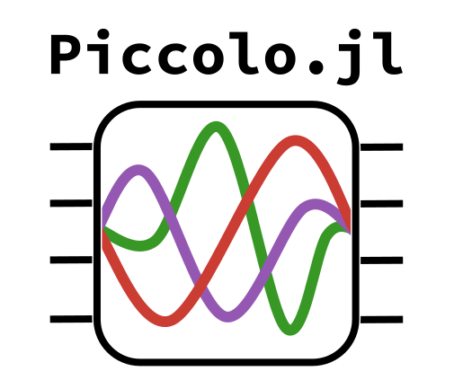

<!--```@raw html-->
<div align="center">
  <a href="https://github.com/harmoniqs/Piccolo.jl">
    
  </a> 
</div>

<div align="center">
  <table>
    <tr>
      <td align="center">
        <b>Documentation</b>
        <br>
        <a href="https://docs.harmoniqs.co/Piccolo/dev/">
          
        </a>
        <a href="https://docs.harmoniqs.co/Piccolo/dev/">
          
        </a>
      </td>
      <td align="center">
        <b>Build Status</b>
        <br>
        <a href="https://github.com/harmoniqs/Piccolo.jl/actions/workflows/CI.yml?query=branch%3Amain">
          
        </a>
        <a href="https://codecov.io/gh/harmoniqs/Piccolo.jl">
          
        </a>
      </td>
      <td align="center">
        <b>License</b>
        <br>
        <a href="https://opensource.org/licenses/MIT">
          
        </a>
      </td>
      <td align="center">
        <b>Support</b>
        <br>
        <a href="https://unitary.fund">
          
        </a>
      </td>
    </tr>
  </table>
</div>
<!--```-->

### Description
**Piccolo.jl** is a meta-package for quantum optimal control using the Pade Integrator Collocation (Piccolo) method. This package reexports the following packages

- [DirectTrajOpt.jl](https://github.com/harmoniqs/DirectTrajOpt.jl)
- [NamedTrajectories.jl](https://github.com/harmoniqs/NamedTrajectories.jl)
- [TrajectoryIndexingUtils.jl](https://github.com/harmoniqs/TrajectoryIndexingUtils.jl)


For documentation please see the individual packages.

### Usage

Just run
```Julia
using Piccolo
```

### Installation
This package is registered! To install enter the Julia REPL, type `]` to enter pkg mode, activate your environment `activate`, and then run 
```Julia
pkg> add Piccolo
```

### Performance guidance

The open stack solves direct-collocation problems with **dense assembled** gradients —
`BilinearIntegrator` for zero-order holds (spline constraints via `DerivativeIntegrator`) —
with **Ipopt** as the default NLP solver and **MadNLP** as an alternative. Dense paths are
fine for small-to-medium problems; on stiff or large ones keep timesteps short and verify
rollouts independently.

The **matrix-free / Altissimo surface** — NewtonCG solves driven by JVP/VJP/HVP products
that never form ∂Φ, the `matrix_free` flag on `HermitianExponentialIntegrator`, the
spline/Magnus and GPU integrator family, and the opt-in exact inequality HVP — lives in the
**proprietary Piccolissimo stack**, not in this repository (see
[docs.harmoniqs.co](https://docs.harmoniqs.co) for that surface).

**2.0 migration:** the `subsystem_levels` kwarg was removed from `SmoothPulseProblem`;
free-phase now derives levels from the goal — wrap gate targets in
`EmbeddedOperator(gate, sys)`.

<!--## Star History-->

<!--[](https://www.star-history.com/#harmoniqs/piccolo.jl&harmoniqs/namedtrajectories.jl&harmoniqs/directtrajopt.jl&Date)-->

*"Technologies are ways of commandeering nature: the sky belongs to those who know how to fly; the sea belongs to those who know how to swim and navigate." – Simone de Beauvoir*
