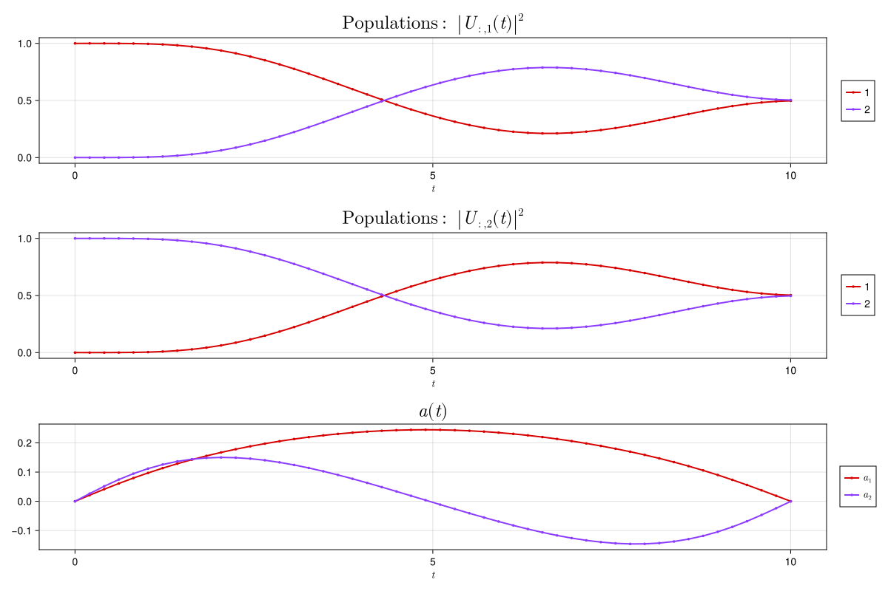

# Piccolo.jl


  
| **Documentation** | **Build Status** | **Support** | **License** |
|:-----------------:|:----------------:|:-----------:|:---------:|
| [](https://kestrelquantum.github.io/QuantumCollocation.jl/dev/) | [](https://github.com/kestrelquantum/QuantumCollocation.jl/actions/workflows/CI.yml?query=branch%3Amain) [](https://codecov.io/gh/kestrelquantum/QuantumCollocation.jl)| [](https://unitary.fund) | [](https://opensource.org/licenses/MIT)

!!! info "Notice"
    This package is under active development and issues may arise -- please be patient and report any issues you find!  

## Description
Piccolo.jl is a meta-package for quantum optimal control using the Pade Integrator Collocation (Piccolo) method. This package reexports the following packages

- [QuantumCollocation.jl](https://github.com/kestrelquantum/QuantumCollocation.jl)
- [NamedTrajectories.jl](https://github.com/kestrelquantum/NamedTrajectories.jl)
- [TrajectoryIndexingUtils.jl](https://github.com/kestrelquantum/TrajectoryIndexingUtils.jl)
- [PiccoloQuantumObjects.jl](https://github.com/kestrelquantum/PiccoloQuantumObjects.jl)
- [PiccoloPlots.jl](https://github.com/kestrelquantum/PiccoloPlots.jl)

For documentation please see the individual packages.

## Installation
This package is registered! To install: enter the Julia REPL, type `]` to enter pkg mode, `activate` your environment, and run 
```julia
pkg> add Piccolo
```

## Usage

```Julia
using Piccolo

T = 50
Δt = 0.2
system = QuantumSystem([PAULIS[:X], PAULIS[:Y]])

# Hadamard Gate
prob = UnitarySmoothPulseProblem(system, GATES[:H], T, Δt)
solve!(prob, max_iter=100)

plot_unitary_populations(prob)
```


## Motivation

Piccolo.jl works with *trajectories* to solve optimization problems for quantum control. A trajectory, $\mathbf{Z}$, is a container for the real-valued state we want to control, and the control variables we use to do so. For example,
```Julia
|julia> Z.names
[:ψ̃, :a]
```
means that $Z$ includes a quantum state, $\ket{\psi}$, and controls, $a$---let's say their components add to $N$. Then, the data for all timesteps $T$ lives in `Z.data` $\in \mathbb{R}^{N \times T}$. It can be accessed by indexing, `Z.a`. For more, see [NamedTrajectories.jl](https://github.com/kestrelquantum/NamedTrajectories.jl) The data must be real-valued, so check out [PiccoloQuantumObjects.jl](https://github.com/kestrelquantum/PiccoloQuantumObjects.jl) for the appropriate isomorphisms.

With a trajectory in hand, a generic *quantum control problem* is a nonlinear program. It looks like
```math
\begin{aligned}
    \arg \min_{\mathbf{Z}}\quad & J(\mathbf{Z}) \\
    \nonumber \text{s.t.}\qquad & \mathbf{f}(\mathbf{Z}) = 0 \\
    \nonumber & g(\mathbf{Z}) \le 0  
\end{aligned}
```
The `UnitarySmoothPulseProblem` mentioned above is a *problem template* that handles setting up a particular $J$, $\mathbf{f}$, and $\mathbf{g}$. There are a variety of problem templates already available in Piccolo.jl, and you can even write your own! See [QuantumCollocation.jl](https://github.com/kestrelquantum/QuantumCollocation.jl) for more.


## Media
Check out our JuliaCon 2023 talk:

```@raw html
<center>
<iframe width="560" height="315" src="https://www.youtube.com/embed/NBdck6UX0Tc?si=YE4iK0mO4GlWnbaW" title="YouTube video player" frameborder="0" allow="accelerometer; autoplay; clipboard-write; encrypted-media; gyroscope; picture-in-picture; web-share" referrerpolicy="strict-origin-when-cross-origin" allowfullscreen></iframe>
</center>
```

Also check out [the sequel, from JuliaCon 2024](https://www.youtube.com/watch?v=v0RPD4eSzVE&t=19980s).


> *"Technologies are ways of commandeering nature: the sky belongs to those who know how to fly; the sea belongs to those who know how to swim and navigate." &ndash; Simone de Beauvoir*
